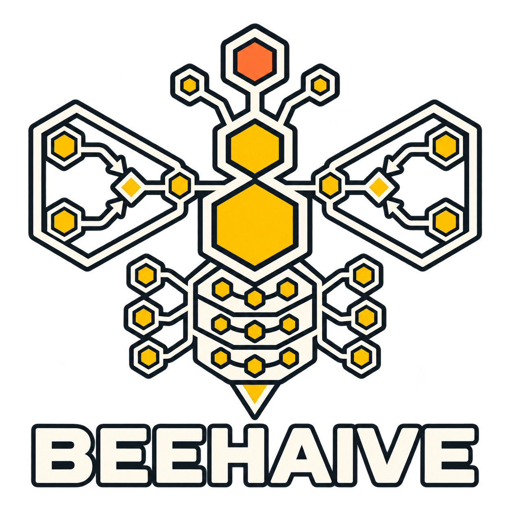

# BeeHAIve

<p align="center">
  
</p>

BeeHAIve is a FastAPI control plane for one allowlisted GitHub Project. The
dashboard reads the live Project state, shows one mission-control board, and
can execute one bounded local demo task.

The demo task is named **bounded repository inventory**. It asks the Codex CLI
to inspect the exact leased Git worktree and report its repository name,
current branch, and tracked-file count. The default task does not edit files.
The dashboard worker can write only inside its leased worktree. Its plain-text
result is shown in the completed work item's run inspector.

This delivery does not claim autonomous swarms, multi-device coordination,
automated production review verdicts, or automatic pull-request creation.

## Clean Windows setup

Prerequisites are Windows, Git, Python 3.13, `uv`, GitHub CLI, Node.js, the
Codex CLI, and Chromium. GitHub access must include the selected Project and
its linked issue metadata.

Install Python 3.13 and `uv`, then check out the repository:

```powershell
git clone https://github.com/TychoHenzen/BeeHAIve.git
Set-Location BeeHAIve
uv sync
gh auth status
Copy-Item .env.example .env
```

Edit `.env` with the selected project and credentials:

```dotenv
GITHUB_TOKEN=<fine-grained-token>
GITHUB_PROJECT_OWNER=<owner>
GITHUB_PROJECT_NUMBER=<number>
GITHUB_PROJECT_OWNER_TYPE=user
# BEEHAIIVE_GITHUB_DISCOVERY_CACHE_SECONDS=600
BEEHAIIVE_ALLOWED_PROJECTS=<owner>:<number>
# Server-side operator authorization. The dashboard never asks for this value.
BEEHAIIVE_API_KEY=<operator-key>
BEEHAIIVE_REVIEW_MODE=demo
# Set this to operator or writer when BEEHAIIVE_REVIEW_MODE=production.
BEEHAIIVE_REVIEW_ACTOR=operator
# BEEHAIIVE_AGENT_REPOSITORY=<path-to-BeeHAIve>
BEEHAIIVE_AGENT_REPOSITORY_NAME=<owner>/<repository>
# BEEHAIIVE_AGENT_TIMEOUT_SECONDS=120
# BEEHAIIVE_CODEX_EXECUTABLE=codex
# BEEHAIIVE_CODEX_MODEL=<model>
# BEEHAIIVE_AUTONOMOUS_MODE=codex
# BEEHAIIVE_AUTONOMOUS_TIMEOUT_SECONDS=0
# BEEHAIIVE_WORKFLOW_REPOSITORY=<path-to-BeeHAIve>
# BEEHAIIVE_STATE_DB=.beehaiive/state.db
# BEEHAIIVE_ROUTING_DB=.beehaiive/routing.db
# BEEHAIIVE_REVIEW_DB=.beehaiive/reviews.db
# BEEHAIIVE_WORKFLOW_DB=.beehaiive/workflow.db
# BEEHAIIVE_SCHEDULER_ENABLED=false
# BEEHAIIVE_SCHEDULER_POLL_INTERVAL_SECONDS=600
# BEEHAIIVE_SCHEDULER_MAX_CONCURRENCY=1
```

The project ID is exactly `<owner>:<number>`. The tracked launcher reads the
gitignored `.env` file before checking these values. Existing process variables
take precedence. `BEEHAIIVE_AGENT_REPOSITORY_NAME` must match the repository
selected in the Project. The timeout must be finite and no greater than 900
seconds for regular worker runs. Autonomous skill contexts have no hard
wall-clock timeout by default. Set `BEEHAIIVE_AUTONOMOUS_TIMEOUT_SECONDS` to a
positive value only when you explicitly want a limit. Project discovery is cached for 10 minutes by default,
so the dashboard's polling does not repeat the full GraphQL discovery.
When `BEEHAIIVE_CODEX_EXECUTABLE` is a bare command such as `codex`, the
autonomous runner resolves the native Windows executable before launching it.
Set `BEEHAIIVE_GITHUB_DISCOVERY_CACHE_SECONDS` to a finite non-negative number
to change that interval. Do not commit `.env` or place its values in screenshots.
Production review reads use `GITHUB_TOKEN` or `GH_TOKEN` with repository
Pull requests read access. Set `BEEHAIIVE_REVIEW_MODE=production` and
`BEEHAIIVE_REVIEW_ACTOR` to `operator` or `writer` to enable review requests.
The current concern adapters retain the GitHub evidence and leave verdicts
pending until concern-specific analysis is configured. They do not write GitHub
reviews or comments.
The continuous scheduler is off by default. Enable it with
`BEEHAIIVE_SCHEDULER_ENABLED=true`; it polls only `BEEHAIIVE_ALLOWED_PROJECTS`
and starts the autonomous lifecycle. Settings can apply polling and worker
capacity to a running server when the workflow-backed worker is configured.
Put the same values in `.env` to retain them after a restart.

Start the service from the repository root so the launcher loads `.env`:

```powershell
.\start_dashboard.bat
```

The launcher checks `uv`, the configured Codex executable, GitHub configuration,
and the API key. It starts `uv run uvicorn main:app --reload` and keeps the
server output visible. Direct Uvicorn startup is supported only when the same
variables are already present in the process environment.

Open `http://127.0.0.1:8000/dashboard?project=<owner>:<number>` and
`http://127.0.0.1:8000/docs`. Viewing and operating the dashboard uses the
server-side `BEEHAIIVE_API_KEY`; the browser does not request, store, or display
that value. Direct API clients still send it as `X-API-Key`.
Use Settings to choose the project and a stored workflow. Use the Queue
filters to switch between active and archived work. Mission control keeps
recent delivery evidence visible while terminal work stays out of the active
queue.
Use `http://127.0.0.1:8000/dashboard?demo=true` for the guided placeholder
lifecycle. Demo actions stay in the browser and make no external changes.

## Autonomous lifecycle

Select **Run lifecycle on server** on a claimable PBI. BeeHAIve starts one
server-side background run and hands the PBI through `refine-backlog-item`, `next-ticket`, published
`submit-draft-pr`, `review-pr-branch`, `fix-pr-review`, and `complete-pr`.
Each skill runs in its own Codex context and receives the previous handover.
Set `BEEHAIIVE_AUTONOMOUS_MODE=placeholder` for the deterministic browser
proof. The default `codex` mode invokes the named local skill files. The
guided demo is the only browser-local placeholder path and is labeled as such.

The scheduler applies the configured worker capacity to autonomous runs and
does not start a second lifecycle for the same project. Handover evidence is
retained in the action log and appears in the run inspector. The advisor runs
once for a blocker, and the run pauses for operator-directed resolution rather
than guessing how to apply advice.

The Queue view separates Refinement, Implementation, Publish, Review, Repair,
Completion, Blocked, and Completed work. The server assigns each PBI one queue
from Project Status and current handoff evidence, so the browser and scheduler
use the same next-skill decision.

Quick idea entry accepts bounded text and an allowlisted Project selection, then
starts one add-backlog-idea context. Its pending, succeeded, or failed action
appears in the dashboard, and a successful capture is visible in that
Project's Backlog. The read-only dashboard config endpoint supplies the
allowlisted Project IDs.

## Create a PBI through the API

Send an authenticated request for a repository linked to the configured
Project. Existing repository labels are optional.

```powershell
curl.exe -X POST "http://127.0.0.1:8000/projects/<project-id>/pbis" `
  -H "X-API-Key: <api-key>" -H "Idempotency-Key: <request-id>" `
  -H "Content-Type: application/json" `
  -d '{"repository":"<owner>/<repo>","title":"<title>","body":"<body>","labels":[]}'
```

The API preserves the supplied title and body. It returns `201` after the issue,
labels, Project membership, and Backlog status read back. It returns `202` for
an incomplete operation. Reuse the same key only for the same request. A key
with changed content returns `409`. If GitHub may have created the issue but
BeeHAIve did not save its identity, the result is `outcome_unknown`; BeeHAIve
will not create another issue for that key, and an operator must reconcile it.

## Run the live demo

1. Confirm the dashboard shows the expected project and linked repositories.
2. Open Queue and select **Start work** on the desired claimable PBI.
3. The dashboard claims that PBI and starts the bounded repository-inventory
   worker.
4. Watch the repository writer and PBI status change to active.
5. Wait for the completed work item. Its run inspector contains the agent's
   plain-text **Result**, and the completed-run count increases.

The dashboard worker uses `codex exec --sandbox workspace-write --ephemeral
--json` in a unique leased worktree. It disables network access and child
agents, passes a filtered environment, and rejects credential-like tracked
files. The service renews both run and worktree leases while the process runs.
On success, the service commits dirty changes with the host Git identity and
pushes the exact leased branch to the configured `origin` without force. A
clean tree is a no-op. A blocked push keeps its commit and worktree for the
dashboard retry action. Failed or cancelled worktrees with changes are kept
for recovery rather than discarded.

Set `git config user.name` and `git config user.email` in the host checkout.
Push uses host Git authentication. Credentials are not sent to the model child
or saved in delivery evidence. Check the work item's run inspector for the
commit SHA and push result.

If the demo fails, open the work-item inspector and read **Failure/Problem** and recent
activity. Check the
GitHub token, exact project allowlist, `codex` availability, and the local
checkout path. Restarting the service does not create a second active writer.
Stop the run before removing local `.beehaiive` state.

## Evidence and verification

Redacted, versioned browser evidence is kept here:

- [Configured dashboard](docs/screenshots/dashboard-configured.png)
- [Active demo](docs/screenshots/active-demo.png)
- [Completed result](docs/screenshots/completed-demo.png)
- [Stopped or failed run](docs/screenshots/stopped-demo.png)

These captures come from the local placeholder browser proof and are redacted
before they are written. They contain no project identifiers, repository names,
or credentials. Regenerate them with:

```powershell
$env:BEEHAIIVE_SCREENSHOT_MODE = "fixture"
uv run python -m scripts.dashboard_screenshots
```

`BEEHAIIVE_SCREENSHOT_MODE=fixture` keeps screenshot generation local and
makes no GitHub or repository changes.

Run the deterministic fixture proof without GitHub mutations:

```powershell
uv run python scripts/dashboard_smoke.py --mode fixture --report .beehaiive/dashboard-smoke.json
```

Run the browser-level lifecycle use cases with a locally installed
Chromium-compatible browser:

```powershell
uv run pytest -m e2e tests/e2e/test_dashboard_lifecycle.py -q
```

Run the live browser proof with the environment configuration above:

```powershell
uv run python scripts/dashboard_smoke.py --mode live --project "$env:GITHUB_PROJECT_OWNER`:$env:GITHUB_PROJECT_NUMBER" --allow-mutations --live-timeout 180 --report .beehaiive/dashboard-live-smoke.json
```

The live smoke exercises the real GitHub Project discovery path. Its local
dashboard actions remain bounded local state changes. The report is redacted
and `.beehaiive` is ignored by Git.

The fixture smoke report runs the same 90 percent coverage threshold as CI.

For the full local gate, run:

```powershell
uv run pytest -q
uv run node --test tests/*.test.mjs
uv run ruff format --check .
uv run ruff check .
uv run pyright
uv run pytest --cov=beehaiive --cov=main --cov-report=term-missing --cov-fail-under=90
```

The worker reads its gate contract from the root `beehaiive-gates.json`.
Checks available only in CI are reported as `external_only`, not as local passes.

The dashboard details, task contracts, and security boundary are documented in
[`docs/dashboard.md`](docs/dashboard.md), [`docs/task-contracts.md`](docs/task-contracts.md),
[`docs/meta-review.md`](docs/meta-review.md), and [`docs/security.md`](docs/security.md).
