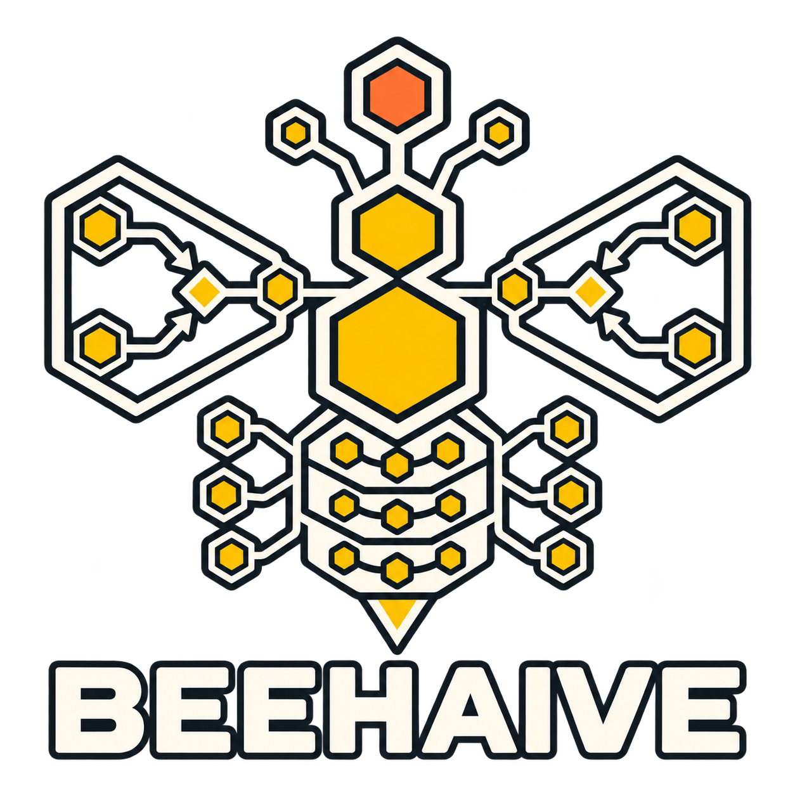

# BeeHAIve

<p align="center">
  
</p>

BeeHAIve is a local FastAPI control plane for one GitHub Project: it reads the
live Board, turns an operator prompt into a validated workflow state machine,
and runs an assigned workflow on an agent with one fresh Codex process per
state. Durable SQLite history keeps the Board, workflow editor, and Agents tab
looking at the same run.

## Setup

Use Windows, Python 3.13, `uv`, GitHub CLI, the Codex CLI, and Node.js. GitHub
access must include the selected Project and its linked issue metadata.

```powershell
git clone https://github.com/TychoHenzen/BeeHAIve.git
Set-Location BeeHAIve
uv sync
gh auth status
Copy-Item .env.example .env
```

Set `BEEHAIIVE_PROJECT_OWNER`, `BEEHAIIVE_PROJECT_OWNER_TYPE`, and
`BEEHAIIVE_PROJECT_NUMBER` in `.env`. `GITHUB_TOKEN` or `GH_TOKEN` is optional
when `gh auth status` can provide a token. Keep `.env` local.

Start the only supported application entrypoint from the repository root:

```powershell
.\start_dashboard.bat
```

The launcher loads `.env`, checks `uv`, `codex`, and `gh auth status`, refuses
an occupied port, starts `uv run python -m beehaiive`, and cleans up its server
process tree on exit. Direct startup uses the same port and configuration:

```powershell
uv run python -m beehaiive
```

Open `http://127.0.0.1:8000/`.

## Product

- **Board** reads the configured Project through the REST API and shows the
  current status columns, cards, holders, and refresh state.
- **Workflows** accepts an operator prompt, generates a deterministic draft,
  validates typed parameters, conditions, skills, and transitions, and lets
  the operator edit or save revisions.
- **Agents** assigns a saved workflow to a dedicated checkout, starts and
  stops runs, claims one Project item at a time, and records each state pass,
  output, error, and recovery event.
- **Hive** is the local observability surface for the durable core state.

An agent run resolves its workflow revision and parameters before it starts.
Each state gets a fresh `codex exec` process with bounded time, isolated run
logs, and the configured skill paths. A stopped or failed run releases its
claim and records the reason; restarting recovers durable state rather than
pretending an old child process is still authoritative. The core does not
write GitHub state.

Project reads are REST-only. Snapshot bodies are cached in SQLite and reused
with ETags; refreshes respect the configured minimum interval and bounded
rate-limit retry behavior. A provider or transport failure is returned as a
controlled API error instead of a fake empty Board.

## Local gate

Run the retained Python and UI tests plus the same static checks used in CI:

```powershell
uv run pytest -q
node --test tests/*.test.mjs
uv run ruff format --check .
uv run ruff check .
uv run pyright
uv run pytest -q --cov=beehaiive --cov-report=term-missing --cov-fail-under=90
uv run pip-audit --progress-spinner off
```

The disposable real-data check should use the configured Project in Edge or
Chromium and record the served URL, visible cards, HTTP outcomes, refresh/ETag
behavior, and browser console state. Local fixtures are not evidence of live
Project behavior.
